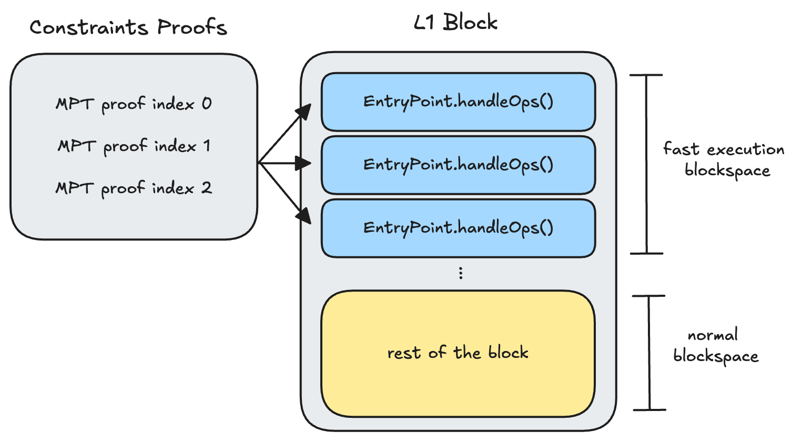

# Flops

## What are flops
Flops ("**F**ixed **L**ocation **Op**erations") is a protocol layered on ERC-4337 that binds each bundled `UserOp` to a specific pre-state. That pre-state is a rolling hash of all earlier FLOps in the block, so any deviation in ordering causes the FLOp to revert and marks the block as broken, enabling slashing of the bundler. 

The result is a simple UX guarantee for `FlopsAccount` users:

> “My `UserOp` either executes on the exact pre-state I expect, or it does not execute at all.”

The FLOps protocol specifies:
- how bundlers cryptographically commit to execution ordering
- how accounts validate that they are executing against the correct pre-state
- how paymasters enforce ordering constraints and detect violations
- how slashers can prove bundler faults using onchain block data

## Why flops
Providing users with revert-protected execution guarantees on Ethereum is non-trivial but worth solving for. State introspection ([EIP-7814]([EIP-7814](https://github.com/ethereum/EIPs/pull/9028))) would make this simple but is unlikely to be added to the protocol.

Today, one of the simplest working designs is [Tobasco](https://github.com/eth-fabric/tobasco?tab=readme-ov-file#how-to-enforce-top-of-block-tob-inclusions-during-execution): a transaction reverts unless it is executed at the top-of-block. Since the pre-state of the top-of-block is always the post-state of the previous block, Tobasco ensures the transaction executes on a known pre-state with no risk of interference.

FLOps aim generalize this idea. If a bundler publicly commits to an ordered sequence of non-reorderable FLOps:
- users know the exact pre-state their FLOp will execute on
- they can simulate against that pre-state locally
- and they can build FLOps that depend on each other’s effects in real time

There is only one true top-of-block position but FLOps create many *virtual* top-of-block positions within the same slot.

This shifts Ethereum toward continuous block building, where the effective slot time becomes the bundler’s FLOp-commitment latency rather than the 12-second block interval.

Users can now submit arbitrarily many interdependent FLOps within a single slot, e.g., multiple trades as CEX prices update in real-time.

Some use-cases:
- **Improves UX for L1 users and LPs**: provides a user experience comparable to high-performance alt-L1s without modifying Ethereum consensus or forking the protocol.
- **Improves L1 ↔ L2 synchronous composability**: removes the need for “true” top-of-block access for cross-domain calls, reducing sequencing costs and allowing many rollups to synchronously compose within the same slot.
- **Reduced impact of exclusive orderflow**: continuous block building helpsl reduce the structural advantage of exclusive orderflow in PBS.

## Flops design
### ERC-4337 recap
Flops introduce deterministic execution ordering on top of the ERC-4337 account abstraction flow, which works as follows:
- Users do not send transactions directly, they submit `UserOps`, which describe:
    - the sender account,
    - the call to execute,
    - gas limits,
    - signatures,
    - and (optionally) a paymaster that will sponsor gas.
- A bundler collects many `UserOps` off-chain, forms a batch, and submits them to the canonical `EntryPoint` contract via:
    - `EntryPoint.handleOps(PackedUserOperation[] calldata ops, address payable beneficiary)`
- Inside `handleOps`, the `EntryPoint`:
	1.	Validates each `UserOp` (signature, nonce, paymaster checks)
	2.	Executes each UserOp sequentially
	3.	Calls the paymaster's `postOp` handler to charge gas or handle reverts
- The result is an “off-chain mempool → on-chain batch execution” pipeline where ordering is entirely under the control of the bundler. ERC-4337 itself provides no mechanism to enforce execution order beyond whatever the bundler chooses.

### ERC-4337 with flops
FLOps add one simple rule to ERC-4337 (without breaking protocol):

> Each UserOp declares the exact pre-state it must see. If the observed pre-state differs, it reverts.

This pre-state enforced by a per-block `rollingHash` stored in the `FlopsPaymaster` contract.

- Start with `rollingHash = bytes32(0)` at the beginning of the L1 block
- When a FLOp is being validated, the paymaster verifies: 
    1. the FLOp’s committed `blockNumber` is the current block's number
    2. the FLOp’s committed `preTxState` match the paymaster’s current `rollingHash` for the block
    3. the FLOp’s approved bundler signed the commitments
    4. the FLOp originated from an account created by the `FlopsAccountFactory`

    Any mismatch marks the entire L1 block as *broken* causing the FLOp and all subsequent FLOps to revert.
    
    Each FlopsAccount enforces this by running a guard before executing its inner call:

    ```solidity
    // The pre-hook each `FlopsAccount` runs
    function _requireForExecute() internal view override {
        _requireFromEntryPoint();
        // FLOps guardrail: once current block is broken, no FlopsAccount should execute
        if (flopsPaymaster.blockBroken()) {
            revert BlockBroken();
        }
    }
    ```
- Upon passing validation each FLOp, the paymaster updates the rolling hash:
    - `rollingHash = keccak256(abi.encode(rollingHash, userOpHash));`

## Flops assumptions
FLOps protect users at runtime on-chain: once a FLOp reaches the `EntryPoint`, it can only execute on its committed pre-state. Any mismatch forces a revert and marks the block as broken.

However, FLOps cannot guarantee the bundler’s off-chain behavior, i.e., a bundler can still:
- censor a FLOp after signing a commitment
- interleave non-FLOp transactions before or between FLOps, breaking pre-state guarantees.

To fully constrain bundler behavior, FLOps should be paired with credible inclusion preconfs that provide a credible way to slash bundlers who: 
- broke blocks
- did not include committed FLOps
- included any L1 transactions prior to any `EntryPoint` calls

## How to punish bundlers (aka flip-floppers)
If a bundler “flip-flops” between what they promised and what they actually built on L1, they need to be slashed.

### 1. Broken blocks
Any broken block sets `blocks[blockNumber].broken = true` at the `FlopsPaymaster`. For simplicity, we assume a `BundlerManager` contract is aware of the L1 preconfer schedule, i.e., Alice was the designated bundler at this block number. This makes it trivial for a slasher contract to tie a broken block to a preconfer to slash.

### 2. Equivocation and Censorship (conflicting batch construction)
In FLOps, bundlers sign per-UserOp commitments that say: “In block `B`, when the rolling hash equals `H_prev`, I (the bundler) will include the `UserOp` with hash `H_user` as the next FLOp.”

The `FlopsPaymaster` has no idea what off-chain commitments were made, it only sees the FLOps that arrive at the `EntryPoint`, allowing a malicious bundler to break commitments (i.e., censor or equivocate) without "breaking the block". 

Fortunately, both censorship and FLOp equivocation are easily proven using the stored rolling hash. A bundler is slashable if they signed a commitment pair (preTxState, userOpHash) that never appears in the FLOps actually included in that block.
```Solidity
function isSlash(
    PackedUserOperation[] memory userOps,
    FlopsCommitment memory commitment,
    uint64 blockNumber
) public returns (bool slash) {
    // 1. Verify bundler actually signed this commitment
    //    Signature covers (blockNumber, preTxState, userOpHash, paymaster)
    verify_bundle_sig(commitment);

    // 2. Load the final rolling hash recorded on-chain for this block
    bytes32 finalRollingHash = paymaster.getRollingHash(blockNumber);

    bytes32 h = bytes32(0);
    bool matchedPair = false;

    for (uint256 i = 0; i < userOps.length; i++) {
        bytes32 opHash = entryPoint.getUserOpHash(userOps[i]);

        // Check whether this UserOp corresponds to the bundler's commitment
        if (h == commitment.data.preTxState && opHash == commitment.data.userOpHash) {
            matchedPair = true;
        }

        // Advance the rolling hash exactly as the paymaster does
        h = keccak256(abi.encode(h, opHash));
    }

    // 3. Confirm the provided UserOps match the actual FLOp sequence recorded on-chain
    //    This prevents fabricated sequences from being used to frame bundlers.
    require(h == finalRollingHash, "UserOps mismatch onchain rolling hash");

    // 4. If the committed transition never appears, bundler lied (equivocation/censorship)
    require(!matchedPair, "Commitment honored — not slashable");

    return true; // slash
}
```

### 3. Top-of-block continuity

[EIP-7825](https://eips.ethereum.org/EIPS/eip-7825) reduces the per-transaction gas limit, which means a bundler may need to submit multiple consecutive `EntryPoint.handleOps()` calls in the same L1 block to support many FLOps.

To guarantee a clean pre-state for FLOps, no non-EntryPoint transaction may appear before any EntryPoint transaction in that block.

In other words for FLOps to get a “virtual top-of-block” environment:
- it's fine to have multiple `handleOps` calls in a row.
- it's not fine to have any other L1 transaction before the any `handleOps`.

Example:
- slashable: `[handleOps, other, handleOps]`
- ok:  `[handleOps, handleOps, other]`

The canonical `EntryPoint` has a `nonReentrant` modifier on `handleOps` that simplifies things:
```Solidity
modifier nonReentrant() {
    require(
        tx.origin == msg.sender && msg.sender.code.length == 0,
        Reentrancy()
    );
    _;
}
```
This means `handleOps` can only be called directly from an EOA, not from smart contracts or EIP-7702 delegated calls. So every `handleOps` invocation is always a top-level L1 transaction with `tx.to == ENTRY_POINT_ADDRESS`.

There is no need to reason about internal calls or nested execution, the slashing condition is purely about L1 transaction ordering. A bundler is slashable for a top-of-block violation if there exist two transactions in the same block:

- `txA with txA.to != EntryPoint`
- `txB with txB.to == EntryPoint`
- `txA.index < txB.index`

This can be proven to a slasher contract via MPT proofs against the transactions trie.

## FLOps for L1
When paired with based preconfirmations, FLOps give users fast execution preconfs that are also revert-protected.
A FLOp can only execute on its committed pre-state. If the pre-state is wrong, it reverts and the block becomes slashable.
This makes FLOps safer than other fast-execution approaches and makes faults simple to reason about and prove.

Using Fabric components like [URC](https://github.com/eth-fabric/urc) and the [Constraints spec](https://github.com/eth-fabric/constraints-specs), implementing FLOps at L1 becomes straightforward.
The preconfer constrains the builder to place the `EntryPoint.handleOps()` transactions at specific indices. MPT proofs against the transaction trie allows constraint satisfaction to be trustlessly proven prior to block publication. Assuming each bundle contains many flops, the number of `EntryPoint.handleOps()` calls could be reduced which minimizes proving latency.

In short: FLOps + based preconfs give Ethereum L1 fast, predictable, simulation-safe execution without protocol changes.



## FLOps for L2s
Rollups are already experimenting with faster confirmation schemes such as [flashblocks](https://docs.base.org/base-chain/flashblocks/apps), [frags](https://gattaca-com.github.io/based-op/scaling#block-production), and other sequencer-level commitments to improve UX.
Today, these systems require fully trusting the sequencer not to equivocate or reorder what they promised.

FLOps provide a simple way to add safety and accountability to these protocols.
When the sequencer plays the role of the FLOps bundler, each fast-confirm commitment becomes verifiable on-chain, and any deviation (i.e., misordering, omission, or conflicting batches) produces a provable fault rather than a trust assumption.

This turns fast L2 confirmations into accountable confirmations with built-in revert protection.

## Notes
This repo is a POC that is meant to be extended. Specifically, the `FlopsAccount` logic is extremely minimal and fails to leverage ERC-4337 (i.e., passkeys/etc). The `BundlerManager` is also intentionally simple, but can be expanded to become preconfer-aware.